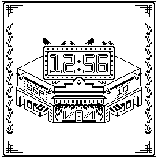
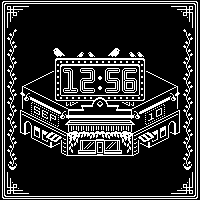

[![CC BY-NC-SA 4.0][cc-by-nc-sa-shield]][cc-by-nc-sa]

# Marquee for Watchy
My (first) attempt at making a bit of a diegetic pixel-arty isometric Watchy watch face. All pixel art is drawn by me. If you like it, I post stuff I draw on my [instagram](https://www.instagram.com/rontalman/) sometimes :).




## In a Nutshell
It conveys more information than it might seem at first!
- The `time` is of course visible on the big billboard on the roof;
- The `date` is visible on the facades of the sides of the building;
- The `battery charge` is visible through the birds on the billboard: Six birds is a full charge and the fewer birds there are, the less charge there is left;
- The `steps` are visible through the vines on the sides. It'll start as an empty pot, but the more you walk, the larger the plant will grow: Every 500 steps it'll grow a new leaf;
- It supports a `dark` and a `light` mode.


#define DARKMODE false

### The Battery Birds
As you can probably tell, there's six little birdies (of different sizes) perched on top of the billboard. If all six are visible, this means the battery is nearly full. But you might notice the birds disappearing (from right to left) one by one. The fewer birds, the less charge the battery has.

### Enabling dark mode
In the file `MarqueeWatch.cpp` on line 7 you can find
```c
#define DARK_MODE false
```

Change `false` to `true` to enable dark mode.

### The Pedometer
First of all, it'll reset at midnight.

Second, you might wonder if, because the maximum amount of leafs on a single vine is 34, it'll stop counting at 17000 steps. And that's a great question and thank you for asking! But no, don't be silly.

Initially (<17000 steps) both vines will grow at the same time and represent the same number. However, should you have a good day and walk more than 17000 steps, the vine on the right will start over and represent the steps *over* the initial 17000 steps. This means that if both vines are full you've taken a whopping 34000 steps in a single day- which is quite the achievement! At this point that doesn't do anything anymore but rest assured that I think you did a great job and you definitely have gotten your steps in for the day.

---
This work is licensed under a
[Creative Commons Attribution-NonCommercial-ShareAlike 4.0 International License][cc-by-nc-sa].

[![CC BY-NC-SA 4.0][cc-by-nc-sa-image]][cc-by-nc-sa]

[cc-by-nc-sa]: http://creativecommons.org/licenses/by-nc-sa/4.0/

[cc-by-nc-sa-image]: https://licensebuttons.net/l/by-nc-sa/4.0/88x31.png

[cc-by-nc-sa-shield]: https://img.shields.io/badge/License-CC%20BY--NC--SA%204.0-lightgrey.svg